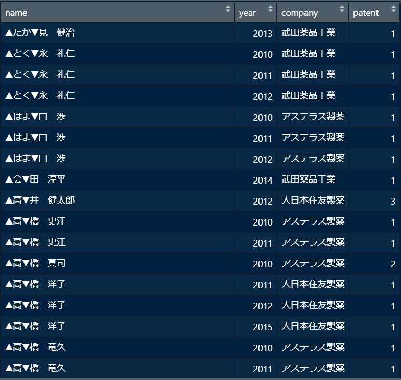

```{r setup, include=FALSE}
knitr::opts_chunk$set(echo = TRUE)
```

---
データハンドリングの第3回目です．
---


# 0. Setup & Agenda

## 準備1: Rプロジェクト
RStudioを開いて右上のタブの File -> New Project から新規プロジェクトを作成しておいてください．

## 準備2: データ
今日使用するデータを作成します．Rプロジェクトが作成出来たら，下のコードをコピペして実行しておいてください．

```{r todays_data}
# 今日使うデータの作成
## 教育年数と賃金
df_left1 <- data.frame(name = c('A', 'B', 'C', 'D'), 
                       education = c(12, 14, 14, 16),      # 教育年数
                       wage = c(2000, 3000, 3000, 3100))   # 賃金
df_left2 <- data.frame(name = c('D', 'E'), 
                       education = c(16, 14), 
                       wage = c(3100, 2700))
## 年齢と居住地
df_right <- data.frame(id = c('A', 'C', 'D', 'E'), 
                       age = c(19, 22, 23, 24),     # 年齢
                       area = c('kanto', 'kanto', 'kinki', 'shikoku')) # 居住地域
# 確認
df_left1 ; df_left2 ; df_right
```

## 準備3: パッケージ
今日も`tidyverse`を使用します．インストールが済んでいない人は先ず`install.packages('tidyverse')`を実行してくださいね．

```{r library_tidyverse}
# tidyverseの呼び出し
library(tidyverse)
```

## Agenda
今日のAgendaは次の通りです．  
1. データ結合  
2. グループワーク  

# 1. データ結合
## 1-1 {base}: rbind(), cbind(), merge()
今日は複数のデータを結合するコマンドを学びましょう．実は今までの講義で何度か触れています．まずはその確認です．

### 行をつなげる: rbind()
データの行を結合したい場合は`rbind()`を使用します (コードの意味は「row(行) + bind(結合)」だと思われます)．まずは結合するデータ`df_left1`と`df_left2`をもう一度見てみましょう．
```{r df_rbind_glimpse}
# 確認
df_left1
df_left2
```
次のようなコードを書きます．「行をつなげる」という意味を確認してください．簡単に言うと縦に並べて結合するということです．
```{r}
rbind(df_left1, df_left2)
```
重複の観測がありますね．各自で重複行を削除してみてください．

### 列をつなげる: cbind()
データを列で結合したい場合は`cbind()`を使用します (コードの意味は「column(列) + bind(結合)」だと思われます)．今度は`df_left1`と`df_right`を結合してみましょう．
```{r}
# 確認
df_left1
df_right
```
次のようなコードを書きます．「列をつなげる」という意味を確認してください．
```{r}
cbind(df_left1, df_right)
```
ただ，これでは`id`列前後で観測がずれてしまっています．`name`と`id`で紐づけて繋げたいですよね．

### 特定の変数で紐づけて結合する: merge()
`merge()`を使えば，特定の変数で紐づけて2つのデータフレームを結合できます．先ほどと同様に`df_left1`と`df_right`を結合してみましょう．前者の`name`と`id`を紐づけます．`by.x`で最初のデータフレームのキー変数，`by.y`で2番目のデータフレームのキー変数を指定します．
```{r}
merge(df_left1, df_right, by.x = 'name', by.y = 'id')
```
ちなみにキー変数の名前が同じ場合は by のみでOKです．
```{r}
# 変数"name" の名前を "id" に変更
df_right_tmp <- df_right %>% 
  rename(name = id)

# キー変数の名前が同じ場合は by のみでOK
merge(df_left1, df_right_tmp, by = 'name')
```
ここでもう一度結合前のデータを見てみてください．先ほどのマージの仕方だと片方のデータフレームのみで観測されているBさんやCさんが抜け落ちてしまっています．
```{r}
df_left1
df_right
```
これらの観測を残してマージしたい場合は`all = TRUE`を指定します．ただし，その観測がない変数の値は`NA`になります．
```{r}
# 観測をすべて残す
merge(df_left1, df_right, by.x = 'name', by.y = 'id', all = TRUE)
```
Eさんの`education`と`wage`, Bさんの`age`と`area`が欠損していることを確認してください．  
片方のデータフレームの観測をすべて残し，もう一方のデータフレームの観測は共通部分のみ取り出すこともできます．
```{r}
# 最初のデータフレームの観測はすべて残す
merge(df_left1, df_right, by.x = 'name', by.y = 'id', all.x = TRUE)
```
`df_left1`に含まれるBさんの観測が残っている一方で，`df_right`に含まれるEさんの観測が抜け落ちていることを確認してください．


## 1-2 {dplyr}: *_join()
`base::merge()`と同様のコマンドが`tidyverse`にもあります．ここでは`dplyr::*_join()`を紹介します．

### 共通部分のみ残す: inner_join()
`tidyverse`で`merge(..., all = FALSE)`にあたるのが`inner_join()`です．`by = c('キー変数1' = 'キー変数2')`で紐づけるためのキー変数を指定します．
```{r}
df_left1 %>% 
  inner_join(df_right, by = c('name' = 'id'))
```
` %>% `によってデータが最初の引数へ引き渡されていることを思い出してくださいね．

### すべて残す: full_join()
すべての観測を残したい場合は`full_join()`を用います.`{base}`で言えば`merge(..., all = TRUE)`と同じですね．
```{r}
df_left1 %>% 
  full_join(df_right, by = c('name' = 'id'))
```

### 片方の観測のみ残す: left_join(), right_join()
片方の観測を残したい場合は`left_join()`または`right_join()`を用います．
```{r}
df_left1 %>% 
  left_join(df_right, by = c('name' = 'id'))
```


# 2. グループワーク: 製薬会社のデータを結合・集計しよう！
グループワークです．2019年三田論製薬班の再現してみましょう．（お兄さんにデータを提供していただきました．ありがとうございます！）

## ＃データ
使用するデータは`inventor.txt`と`pharma_patent.xlsx`です．いずれも特許に関するデータですが，前者は開発者個人の氏名，後者は企業名がそれぞれ観測されています．
.txtファイルは次のように読み込みます．
```{r}
# データの取り込み1: テキストデータ
df_inventor <- read.table('data/inventor.txt', header = T, sep = ',')

# 確認
head(df_inventor)
```

.xlsxファイルの読み込みには`openxlsx`というパッケージを使用します．まだインストールしていない人は`install.packages(openxlsx)`をまず実行してくださいね．
```{r}
# パッケージの呼び出し
library(openxlsx)
df_pharma <- read.xlsx('data/pharma_patent.xlsx')

# 確認
head(df_pharma)
```

## ＃課題
開発者・年度・企業ごとの取得特許件数をまとめたデータフレームを作成してください！  
こんなイメージです．(`patent`が特許件数を表しています．)


## ＃ヒント
次のステップで進めるとうまくいくと思います．  
1.  `df_inventor`と`df_pharma`を結合し，`df_patent`というデータフレームを作成する  
2.  `df_patent`を集計する  
  
また，データの型や観測の重複に注意するようにしてください．
