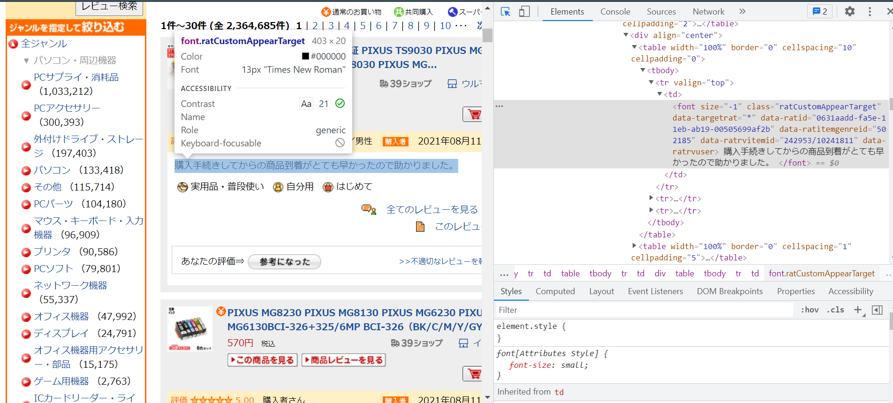

2021年度 サブゼミ 第13回 Webスクレイピング
================
Yoshinari Namba
2021/8/11

# 0. イントロダクション

今日のAgendaは以下の3つです．  
1. スクレイピングの概要  
2. Rでの実装  
3. グループワーク

自力でWebからデータを取ってこれるようになることが今日の目標です！

# 1. スクレイピングの概要

## スクレイピングとは?

スクレイピングはWeb上のデータを自動で取得する方法です．  
欲しいデータの量が少ないときはコピペ・ダウンロードすれば良いのですが，膨大なデータが必要な場合は手作業でやると大変です．そこでスクレイピングを使います．

## 必要な知識

Webからデータを取ってくるので，Webサイトを構成するコード(HTML・CSS)をある程度知っておく必要があります.  
- HTML: Webページの枠組みを作る  
- CSS: HTML作った枠組みに肉付け(文字や配色の詳細設定)を行う

今日は深入りしないでおきます．とりあえず，HTMLが「大見出し→小見出し→本文」のような階層構造を持っていることだけ頭に入れておいて下さい！

## 注意点

サーバーを攻撃していると見なされると大変なことになります。データを繰り返し取得する際には適切な時間を空けましょう

## スクレイピングの手順

スクレイピングはざっくり以下の手順で行います(小澤さんのQiita記事)．  
1. 欲しいデータが載っているサイトを探す  
2. 欲しいデータがそのサイトのどの部分に記載されているかを把握する
@ブラウザ  
3. Rでコードを書いてデータを取得する @R

以降はこの手順で実装していきます！

# 2. Rでの実装

## 2-1. 欲しいデータが載っているサイトを探す

PC周辺機器の口コミを分析するケースを考えてみます．口コミはいろんなサイトに載っていると思いますが，ここでは楽天のレビューを使うことにしましょう．

## 2-2. 欲しいデータがそのサイトのどの部分に記載されているかを把握する @ブラウザ

### HTMLコードを開く

次のリンクから楽天のレビューページを開いてください．  
- <https://review.rakuten.co.jp/search/-/100026/cu1001-d0/>

開けたら右クリックをして「検証」を選択してください
(Edgeユーザーは「開発者ツールで調査する」)．

### 欲しいデータがHTML上のどの階層に位置しているのかを確認

左上の矢印マークを押して，欲しいデータが載っている場所をクリックしてください．  
ハイライトされているコードの中に`<font ... class = "ratCustomAppearTarget" ...>`という部分が見つかると思います．`class`は欲しいデータがHTML上のどこに位置しているのかを指定するうえで便利なコードです．
 ちなみに[Selector
Gadget](https://chrome.google.com/webstore/detail/selectorgadget/mhjhnkcfbdhnjickkkdbjoemdmbfginb?hl=en)というGoogle
Chromeの拡張機能を使うとパスがもっと簡単に取り出せるようです．

## 2-3. Rでコードを書いてデータを取得する @R

コーディングは以下の手順で行います  
- Step1: 準備  
- Step2: 1つページからデータを取得  
- Step3: Step2を利用して2ページ目以降からデータを自動的に取得

### Step1: 準備

RStudioを開いて右上のタブの File -> New Project
から新規プロジェクトを作成しておいてください．

#### パッケージのインストール

スクレイピングには`rvest`というパッケージを使用します．  
あとで使う`tidyverse`も合わせて先に必要なパッケージを呼び出しましょう．

``` r
# パッケージのインストール
install.packages("rvest")

# パッケージの呼び出し
library(rvest)
library(tidyverse)
```

まだインストールしていない人は`install.packages("tidyverse")`から実行するようにしてください．

#### ウェブサイトを指定する

まずはサイトのurlを指定します．htmlを読み込むには`rvest::read_html()`を使います．

``` r
# 対象のサイトのURLを指定
url <- read_html("https://review.rakuten.co.jp/search/-/100026/cu1001-d0/")
```

実行してみるとエラーが出てしまいます．エンコ―ディングの問題で読み込めないみたいです．正しいエンコードを知るには`guess_encoding()`を使います．

``` r
guess_encoding("https://review.rakuten.co.jp/search/-/100026/cu1001-d0/")
```

    ## # A tibble: 5 x 2
    ##   encoding   confidence
    ##   <chr>           <dbl>
    ## 1 EUC-JP           1   
    ## 2 Big5             0.85
    ## 3 GB18030          0.79
    ## 4 EUC-KR           0.64
    ## 5 ISO-8859-1       0.26

このサイトは`EUC-JP`というエンコードが信憑性が高そうです．このエンコードで再度読み込みます．

``` r
# エンコードを指定して再度読み込み
url <- read_html("https://review.rakuten.co.jp/search/-/100026/cu1001-d0/", 
                 encoding = "EUC-JP")
```

### Step2: 1つのページからデータを取得

urlから欲しいデータを取ってくるには`html_nodes()`というコマンドを使用します．`()`内には先ほどブラウザで確認したパス(HTML上の位置)を指定します．ここではxpathと呼ばれるものを使います．xpathは`//*[@class = "class名"]`のように表されます．class名は`"ratCustomAppearTarget"`でしたね．  
また，取ってきたデータを文字列の形式で出力するために`html_text()`を使います．

``` r
# データの取得
reviews <- url %>% 
  html_nodes(xpath = '//*[@class="ratCustomAppearTarget"]') %>%  # 欲しい情報の位置を指定
  html_text()                                                    # 文字列で出力
```

ちゃんとデータが取れているか最初の10行を確認してみましょう．

``` r
# 確認
head(reviews, n = 10)
```

    ##  [1] "\n早めにつきました！\n外国産な感じのパッケージで、叱りしていました！\nただ、二回目なためか？\n購入明細がなくて、少し残念な感じがしました！？\nできれば、日本語の商品説明がある明細もあればいいと思いました！\nでも、全体的には、大満足です！\nありがとうございました！\n"
    ##  [2] "\n天板に傷がありますが、中古なのでOKです。\nキーボード部分もとてもきれいで良かったです。このお値段で自分のパソコンが持てるなんて嬉しいです。\n"                                                                                                                          
    ##  [3] "\n２つも...と思いましたが買って良かったです。\nエアコンの風が直で当たらず子供達も快適のようです★\nもうひとつは家の脱衣所や食卓で大活躍でした♪\n充電して持ち運べるのが何より便利でした☆\n"                                                                             
    ##  [4] "\nサイズもちょうどよく、届いてすぐ使用しています。\n気に入ったようでとても喜んでいます。スイッチライトに使用しています。\n線が壊れにくそうな素材でいいですね。\n"                                                                                                        
    ##  [5] "\n外観非常にきれい\nキーボードもきれい\nコストパフォーマンス大変良い\n"                                                                                                                                                                                                  
    ##  [6] "\nウッド調の電源タップとても可愛いです♪USBポートも２つあり便利です！もう1つ購入しようとおもってます！\n"                                                                                                                                                                
    ##  [7] "\n思っていたよりもサイズが大きかったので驚きましたが風量も強くて良かったです！\nベビーカー用にと買いましたが普段使いできそうです。\n"                                                                                                                                    
    ##  [8] "\nすぐに届きました。\n車が暑いので、チャイルドシートに風を送るように購入。\n風量は強風は出ませんが、弱すぎずちょうどいいのでこれから活用するのが楽しみです。\n"                                                                                                          
    ##  [9] "\n適度にスペックの良い、大画面のノートPCを探していて、この商品に会いました。\n富士通CELSIUSのことは知っていたので、一度は使ってみたいと思っていました。\nRPAやPythonを動かしてみて実務で活用したいです。\n"                                                              
    ## [10] "\nマウスパッドが古くなったので、購入しました。\n"

`\n`が何度も出てきて気持ち悪いですね…
`str_replace_all()`を使って消してみましょう．
(ちなみに`\n`は改行を表しています．)

``` r
# \n を削除
reviews <- reviews %>% 
  str_replace_all(pattern = '\n', replacement = '')

# 確認
head(reviews, n = 10)
```

    ##  [1] "早めにつきました！外国産な感じのパッケージで、叱りしていました！ただ、二回目なためか？購入明細がなくて、少し残念な感じがしました！？できれば、日本語の商品説明がある明細もあればいいと思いました！でも、全体的には、大満足です！ありがとうございました！"
    ##  [2] "天板に傷がありますが、中古なのでOKです。キーボード部分もとてもきれいで良かったです。このお値段で自分のパソコンが持てるなんて嬉しいです。"                                                                                                                
    ##  [3] "２つも...と思いましたが買って良かったです。エアコンの風が直で当たらず子供達も快適のようです★もうひとつは家の脱衣所や食卓で大活躍でした♪充電して持ち運べるのが何より便利でした☆"                                                                       
    ##  [4] "サイズもちょうどよく、届いてすぐ使用しています。気に入ったようでとても喜んでいます。スイッチライトに使用しています。線が壊れにくそうな素材でいいですね。"                                                                                                
    ##  [5] "外観非常にきれいキーボードもきれいコストパフォーマンス大変良い"                                                                                                                                                                                          
    ##  [6] "ウッド調の電源タップとても可愛いです♪USBポートも２つあり便利です！もう1つ購入しようとおもってます！"                                                                                                                                                    
    ##  [7] "思っていたよりもサイズが大きかったので驚きましたが風量も強くて良かったです！ベビーカー用にと買いましたが普段使いできそうです。"                                                                                                                          
    ##  [8] "すぐに届きました。車が暑いので、チャイルドシートに風を送るように購入。風量は強風は出ませんが、弱すぎずちょうどいいのでこれから活用するのが楽しみです。"                                                                                                  
    ##  [9] "適度にスペックの良い、大画面のノートPCを探していて、この商品に会いました。富士通CELSIUSのことは知っていたので、一度は使ってみたいと思っていました。RPAやPythonを動かしてみて実務で活用したいです。"                                                      
    ## [10] "マウスパッドが古くなったので、購入しました。"

とりあえずこのページから必要なデータが取れましたね．

### Step3: 2ページ目以降からデータを自動的に取得

1ページで終わりならコピペとそれほど労力はかわらないかもしれません．でも，数十，数百ページからデータを取ろうとするとスクレイピングの方が圧倒的に早いです．  
ここからはStep2で書いたコードを使って複数ページからデータを取得するコードを書きます

#### URLの規則を把握する

ページを変えるとURLも変わるため，指定するURLを変えなければいけません．  
URLの変化の仕方が規則的ならば複数ページからデータを取る作業を自動化することができます．  
実際に2ページ目を見てみると末尾が`....-d0-p2/`，3ページ目は`...-d0-p3/`となっています．

#### 自動化

Step2で行ったことを繰り返しのfor構文を使って2ページ目以降にも実行してみましょう．  
その際，サーバーに攻撃しているとみなされないよう，`Sys.sleep()`で1秒以上時間を空けるようにしてください．

``` r
# データを取得
for(i in 2:10){
  url_tmp <- paste0("https://review.rakuten.co.jp/search/-/100026/cu1001-d0-p", i, "/") %>% # iページ目のURLを作成
    read_html(encoding = "EUC-JP")                                  # 読み込み
  reviews_tmp <- url_tmp %>% 
    html_nodes(xpath = '//*[@class="ratCustomAppearTarget"]') %>%   # データの位置を指定 
    html_text() %>%                                                 # 文字列の形式で出力
    str_replace_all(pattern = "\n", replacement = "")               # 文字を整える
  reviews <- c(reviews, reviews_tmp)                                # (i-1)ページ目までのデータと結合
  Sys.sleep(1)                                                      # 1秒時間を空ける
}

# 確認
reviews[201:210]
```

    ##  [1] "機能が沢山あるので便利だと思います。ただし、充電時間が長い！使用時間の表記はあるけど、充電時間の表記が見当たらない。バッテリーの残量が分かる機能があれば良かったのになぁ。"                                                                                                                                                                                                       
    ##  [2] "PS2についてくるavケーブルが使えないモニターでPS2を使用するために購入。すぐ届いて接続したら、使えました。HDMIケーブルは持っているので、HDMIケーブルはつかない安いのでよかったです。付属のケーブルは何に使うのかなと思いましたが、ps2の手前にあるusbに繋いだら使えました。あと、モニターの入力切替が必要でしたが、とても簡単。他の方のいうとおり、PS1のソフトはうつりませんでした。"
    ##  [3] "ＰＣを追加購入しました。長く使ってきた機種なので安心です。"                                                                                                                                                                                                                                                                                                                       
    ##  [4] "コスパ最高だと思います！値段が上がったのは残念ですが今後も続けてほしい商品です。"                                                                                                                                                                                                                                                                                                 
    ##  [5] "大変安価で、地図上の位置も適正で満足です"                                                                                                                                                                                                                                                                                                                                         
    ##  [6] "主人に頼まれて購入しました。箱なしだけど使うのには何も問題なく安く購入出来良かったです。"                                                                                                                                                                                                                                                                                         
    ##  [7] "CanonのTS8130に使用していますが、本カートリッジを装着すると純正カーリッジとして認識します。ちなみにEpsonの場合は、社外品が装着されたと表示されます。"                                                                                                                                                                                                                             
    ##  [8] "更新用のためか、現在使用中のIDやら、なんちゃらキーやら、パスワードやら、いろいろ入力しないといけない。３年前に購入した当時もダウンロード版でメールとかも残っておらず、なんちゃらキーを調べるのに時間がかかった。調べ方とか、分かりやすくしてほしい。"                                                                                                                             
    ##  [9] "注文後すぐに届きました。ありがとうございました。初めて飲みましたが、美味しいです。とても飲みやすいので毎日続けれそうです。"                                                                                                                                                                                                                                                       
    ## [10] "MacBookと iPadが安心して持ち運びできそうです！アイマスクが入ってなくてガッカリでした。"

# 3. グループワーク

今まで学んだことを実践してみましょう．
次のサイトから東京都港区のコンビニのデータを取得してみてください．  
- <https://www.homemate-research-convenience-store.com/13103/>

欲しいデータは  
- 店舗名  
- 住所

とします．時間に余裕があったらこれらを1つのデータフレームにまとめてみてください．また，
- 口コミ数

もGetしてみてください．

# \< 参考 \>

-   小澤さん「RでのWeb
    スクレイピング入門」(<https://qiita.com/Tom-tom-tom/items/998e8282d013fb218490>)  
-   村松ほか, 「スクレイピングによるデータ収集」, 技術評論社,
    『RユーザーのためのRStudio「実践」入門』，第2章
