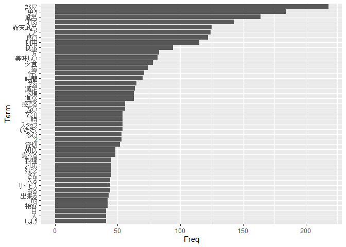
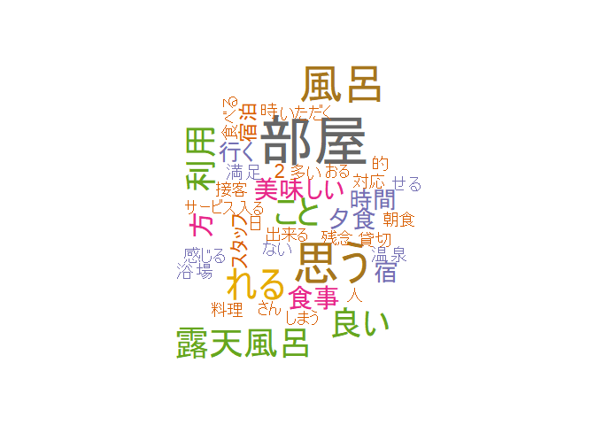

2021年度 サブゼミ 第14回 テキストマイニング
================
Yoshinari Namba
2021/9/9

# 0. イントロダクション

## テキストマイニングとは?

テキストマイニング (text mining)
は文字通り，テキストデータから意味のあるパターンやインサイトを探索する分析のことです．
マーケティングの領域ではアンケートの自由回答欄を分析する際に使われているほか，人文科学の分野でも書き手の癖を見つけたり，作者未詳の作品の書き手を判別する際に利用されているそうです．

## Agenda

今日のAgendaは次の通りです.  
1. テキストデータの集計・可視化  
2. 共起ネットワーク  
3. 対応分析  
4. その他の分析  
大まかな分析からより詳細な分析にステップアップする流れで進めていきます．

## セットアップ

テキストマイニングを始める前に分析環境を整えます．

### 準備1: MeCabのインストール

[これ](http://taku910.github.io/mecab/#download)に沿ってMeCabをダウンロードしてください．

### 準備2: Rプロジェクト

RStudioを開いて右上のタブの File -> New Project
から新規プロジェクトを作成しておいてください．

### 準備3: データ

今日のデータは`jalan.csv`を使用します．これは宿泊予約サイトじゃらんにリスティングされている[「季の湯
雪月花」の口コミページ](https://www.jalan.net/yad371898/kuchikomi/?screenId=UWW3001&stayCount=1&yadNo=371898&dateUndecided=1&roomCount=1&roomCrack=200000&adultNum=2&callbackHistFlg=1&smlCd=141602&distCd=01&activeSort=5)をスクレイピングしたものです．  
Rプロジェクトが作成出来たら以下のコードを実行してください．

``` r
df_jln <- read.csv("jalan.csv", fileEncoding = "Shift-JIS")

# 確認
View(df_jln)
```

### 準備4: パッケージ

以下のコードを実行して，今日使用するパッケージをインストール&呼び出しします．
(最初の2つはインストール済みだと思います.)

``` r
# インストール
install.packages("RMeCab")
install.packages("tidyverse")
install.packages("magrittr")
install.packages("wordcloud")
install.packages("igraph")
install.packages("FactoMineR")
install.packages("factoextra")

# 呼び出し
library(tidyverse)
library(RMeCab)
library(magrittr)
library(wordcloud)
library(igraph)
library(FactoMineR)
library(factoextra)
```

    ## -- Attaching packages --------------------------------------- tidyverse 1.3.1 --

    ## v ggplot2 3.3.5     v purrr   0.3.4
    ## v tibble  3.1.4     v dplyr   1.0.7
    ## v tidyr   1.1.3     v stringr 1.4.0
    ## v readr   2.0.1     v forcats 0.5.1

    ## -- Conflicts ------------------------------------------ tidyverse_conflicts() --
    ## x dplyr::filter() masks stats::filter()
    ## x dplyr::lag()    masks stats::lag()

    ## 
    ##  次のパッケージを付け加えます: 'magrittr'

    ##  以下のオブジェクトは 'package:purrr' からマスクされています: 
    ## 
    ##      set_names

    ##  以下のオブジェクトは 'package:tidyr' からマスクされています: 
    ## 
    ##      extract

    ##  要求されたパッケージ RColorBrewer をロード中です

    ## 
    ##  次のパッケージを付け加えます: 'igraph'

    ##  以下のオブジェクトは 'package:dplyr' からマスクされています: 
    ## 
    ##      as_data_frame, groups, union

    ##  以下のオブジェクトは 'package:purrr' からマスクされています: 
    ## 
    ##      compose, simplify

    ##  以下のオブジェクトは 'package:tidyr' からマスクされています: 
    ## 
    ##      crossing

    ##  以下のオブジェクトは 'package:tibble' からマスクされています: 
    ## 
    ##      as_data_frame

    ##  以下のオブジェクトは 'package:stats' からマスクされています: 
    ## 
    ##      decompose, spectrum

    ##  以下のオブジェクトは 'package:base' からマスクされています: 
    ## 
    ##      union

    ## Welcome! Want to learn more? See two factoextra-related books at https://goo.gl/ve3WBa

# 1. テキストデータの集計・可視化

## 1.1 ざっくり見てみる

まずはデータを確認します．`summary()`を使うのが定石でしたね．

``` r
df_jln %>% summary()
```

    ##     gender              age                rating      kuchikomi        
    ##  Length:199         Length:199         Min.   :1.00   Length:199        
    ##  Class :character   Class :character   1st Qu.:4.00   Class :character  
    ##  Mode  :character   Mode  :character   Median :4.00   Mode  :character  
    ##                                        Mean   :4.07                     
    ##                                        3rd Qu.:5.00                     
    ##                                        Max.   :5.00

なんか微妙ですね．データの型が`character`だと`summary()`から有益な情報が得られません．特に`gender`と`age`は「男性or女性」だったり「20代,
30代…」というカテゴリカル変数になっているので，それぞれに当てはまる人数をカウントしてほしいですよね．`table()`を使う方法もありますが，ここでは`dplyr::mutate_at()`という関数を使って`gender`と`age`の型を`factor`型に直し，一気に分布を確認しましょう.  
型の変換には`as.factor()`を使っており，`mutate_at()`の`.funs =`で指定しています.

``` r
df_jln %>% 
  mutate_at(.vars = vars(gender, age), 
            .funs = as.factor) %>% 
  summary()
```

    ##   gender      age         rating      kuchikomi        
    ##  女性:130   20代:85   Min.   :1.00   Length:199        
    ##  男性: 69   30代:41   1st Qu.:4.00   Class :character  
    ##             40代:26   Median :4.00   Mode  :character  
    ##             50代:25   Mean   :4.07                     
    ##             60代:19   3rd Qu.:5.00                     
    ##             70代: 2   Max.   :5.00                     
    ##             80代: 1

これで男女，各年代についてそれぞれ何人ずついるのかわかりましたね．

## 1.2 .txtファイルの出力

`summary()`を見たのでさっそく分析に入っていきたいところですが，もう少し準備が必要です．  
スクレイピングなどで取得するデータの多くはデータフレームの形をしていますが，実はテキストマイニングに必須の`RMeCab`ライブラリに入っている関数の多くは`.txt`のファイルを直接読み込む仕様になっています．つまり，データフレームに含まれているテキストデータを`.txt`ファイルで出力する必要があるのです．  
まずはテキストデータを出力するフォルダ(ディレクトリ,
directory)を用意しましょう．フォルダ名はなんでもいいですが，`kuchikomi`とします

``` r
# フォルダの作成
dir.create("kuchikomi")
```

そしてこの`kuchikomi`フォルダにテキストデータを`.txt`形式で格納します．

``` r
writeLines(text = use_series(df_jln, kuchikomi), con = "./kuchikomi/kuchikomi.txt")
```

ここでは`magrittr::use_series()`を使用しています．データフレームの形をとっていた口コミデータを一つのデータに直すイメージですね．  
また，ドット`.`は現在の作業場(ディレクトリ)を表します．相対パスですね．`kuchikomi`フォルダに`kuchikomi.txt`というファイルを作成するコマンドになっています．

## 1.3 頻度表

ようやく準備ができました．さっそく分析に入っていきましょう．  
まずは頻度表を作成します．単語ごとの出現回数をカウントしたものですね．頻度表の作成には`RMeCab::RMeCabFreq()`という関数を使います．オブジェクト名は`df_freq`としておきましょう．再び相対パスを使ってファイルを指定します．

``` r
df_freq <- RMeCabFreq("./kuchikomi/kuchikomi.txt")
```

    ## file = ./kuchikomi/kuchikomi.txt 
    ## length = 2686

``` r
# 確認
df_freq %>% head()
```

    ##         Term    Info1 Info2 Freq
    ## 1     なんか フィラー     *    1
    ## 2         ま フィラー     *    1
    ## 3       あっ   感動詞     *    1
    ## 4 ありがとう   感動詞     *   32
    ## 5     うーん   感動詞     *    1
    ## 6         え   感動詞     *    1

`Term`, `Info1`, `Info2`, `Freq`はそれぞれ，単語，品詞(大分類),
品詞(小分類), 出現頻度を表します．

``` r
# 観測数
nrow(df_freq)
```

    ## [1] 2686

観測数が多いので，ここでは特に重要と思われる単語のみに絞ります．品詞は名詞，形容詞，動詞の三つ，頻度は40以上とし，あまり意味のない単語は削除したものを`df_freq2`とします．

``` r
df_freq2 <- df_freq %>% 
  filter(Info1 %in% c("名詞", "形容詞", "動詞")) %>% 
  filter(Freq >= 40) %>% 
  filter(!Term %in% c("いる", "ある", "の", "なる", "できる", "する")) 

# 確認
df_freq2 %>% head()
```

    ##         Term  Info1 Info2 Freq
    ## 59      ない 形容詞  自立   56
    ## 115     多い 形容詞  自立   53
    ## 131 美味しい 形容詞  自立   82
    ## 144     良い 形容詞  自立  122
    ## 403   感じる   動詞  自立   56
    ## 460     行く   動詞  自立   71

### 1.3.1 棒グラフの作成

頻度表を作るだけだとデータがどんな意味を持っているか分かりづらいです．可視化してみましょう．2通り試してみます．まずは`ggplot2::ggplot()`を使って棒グラフを作成します.

``` r
df_freq2 %>% 
  mutate(Term = reorder(Term, Freq)) %>% 
  ggplot(aes(Term, Freq)) + geom_col() + coord_flip()
```

<!-- -->
上のコマンドは，`mutate()`内の`reorder`で`Term`を頻度`Freq`の大きい順に並べなおし，`ggplot()`で軸を決め，`geom_col()`で棒グラフを作成し，`coord_flip()`でxy軸をひっくり返してます．

### 1.3.2 ワードクラウドの作成

棒グラフも少し見づらい気がします．今度は`wordcloud::wordcloud()`を使ってワードクラウドを作ってみましょう．

``` r
wordcloud(df_freq2$Term, df_freq2$Freq, color = brewer.pal(8, "Dark2"))
```

<!-- -->

最初の引数で単語，次の引数で頻度を指定することで，頻度が多い単語を大きく描いています．また，`color =`で色分けしています．  
ずいぶん見やすくなりましたね．この宿は「露天風呂」がついていて，「夕食」が「美味しい」のだろうとなんとなく想像できます．一方で「残念」という単語が見られるように，ネガティブな意見もあるようです．

# 2. 共起ネットワーク

続いて，共起関係についてみていきます．  
共起(collocation)とは，ある単語が特定の別の単語と隣接して現れることです．共起関係を見ることで文脈が浮かび上がってきます．
